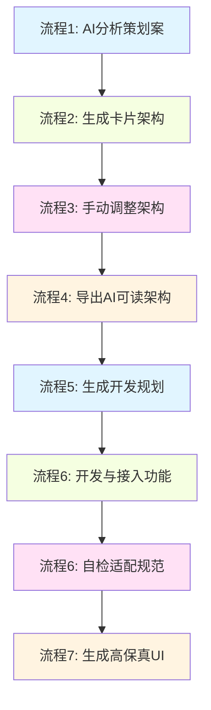

# GUXY 工作流程指南

> 本指南详细说明GUXY AI工作流平台的完整工作流程，帮助游戏交互设计师高效完成从策划案到高保真UI的全流程。

---

## 工作流程总览

---

## 流程1: AI分析策划案

### 目的

使用AI分析策划案，提取并补全交互逻辑，生成标准化的交互逻辑记录。

### 输入

- 策划案文件（.txt, .md, .xlsx, .xls）
- 功能需求说明
- 参考设计文档

### 使用工具

- Skill: `01-ai-analysis`
- 文档模板: `docs/01-interactive-logic-records.md`

### 执行步骤

1. **准备阶段**
   - 收集策划案和相关需求文档
   - 确认分析范围和重点
   - 准备AI分析所需的上下文信息

2. **AI分析**
   - 使用AI分析方法skill读取策划案
   - AI提取功能模块和交互逻辑
   - 补全缺失的交互细节

3. **生成交互逻辑记录**
   - 填充交互逻辑记录模板
   - 定义功能模块边界
   - 梳理交互流程步骤
   - 规范界面层级（1/2/3级）
   - 明确信息展示方式

4. **输出文件**
   - `docs/01-interactive-logic-records.md`（交互逻辑记录）

### 输出

- 完整的交互逻辑记录文档
- 功能模块定义
- 交互流程图
- 界面层级规范
- 信息展示方式说明

### 注意事项

- 确保AI分析的准确性，人工审核关键部分
- 明确标记AI做出的假设
- 保留原始策划案作为参考
- 记录分析过程中的疑问和决策

---

## 流程2: 生成卡片式交互架构

### 目的

基于交互逻辑记录，使用AI生成可编辑的卡片式交互架构（JSON格式）。

### 输入

- 流程1生成的交互逻辑记录
- 架构模板

### 使用工具

- Skill: `02-architecture-gen`
- 模板: `templates/architecture-template.json`

### 执行步骤

1. **读取交互逻辑记录**
   - 分析功能模块定义
   - 理解交互流程步骤
   - 确认界面层级规范

2. **AI生成架构**
   - 使用架构生成skill
   - 生成集合（collections）
   - 生成卡片（cards）
   - 生成连线（links）
   - 自动分配位置信息

3. **架构质量检查**
   - 检查节点连接完整性
   - 验证界面层级正确性
   - 确认入口路径清晰
   - 检查是否有孤立节点

4. **输出架构文件**
   - 导出为JSON格式
   - 兼容PiaJi架构格式

### 输出

- `architecture-[feature-name].json`（架构文件）
- 包含collections、cards、cardLinks、collectionLinks、cardCollectionLinks

### 注意事项

- 参考PiaJi的架构格式确保兼容性
- 必须包含一个"主界面"集合
- 正确设置interface_level（1/2/3）
- 标记hint类型卡片

---

## 流程3: 手动调整卡片架构

### 目的

在PiaJi平台中手动调整AI生成的卡片架构，优化交互流程和布局。

### 输入

- 流程2生成的架构JSON文件
- PiaJi在线版平台

### 使用工具

- PiaJi在线版（`../PiaJi/online/index.html`）

### 执行步骤

1. **导入架构到PiaJi**
   - 打开PiaJi在线版
   - 导入架构JSON文件
   - 查看自动布局结果

2. **调整集合结构**
   - 优化功能分组
   - 调整集合名称和描述
   - 设置正确的集合类型（战斗/系统/剧情/关卡）

3. **调整卡片内容**
   - 完善卡片标题和描述
   - 设置正确的界面层级
   - 添加必要的注释信息
   - 上传参考图片（可选）

4. **优化连线关系**
   - 调整卡片之间的连线
   - 完善连线标签说明
   - 检查主界面入口
   - 确保交互流程流畅

5. **保存架构**
   - 使用自动布局功能
   - 保存到本地IndexedDB
   - 导出更新后的架构文件

### 输出

- 优化后的架构JSON文件
- PiaJi中的可视化架构图

### 注意事项

- 保持架构的可读性和可维护性
- 避免过度复杂的连线
- 确保每张卡片都有明确的目的
- 定期保存防止数据丢失

---

## 流程4: 导出AI可读架构

### 目的

将优化后的交互架构导出为AI可理解的格式，用于后续的开发规划。

### 输入

- 流程3优化后的架构JSON文件

### 使用工具

- PiaJi的"导出AI可读"功能

### 执行步骤

1. **在PiaJi中导出**
   - 打开优化后的架构
   - 点击"导出AI可读"
   - 复制或下载导出内容

2. **格式验证**
   - 确认JSON格式正确
   - 检查所有节点和连接关系
   - 验证必要的元数据

3. **保存导出文件**
   - 保存为`architecture-export-[feature].json`
   - 添加必要的说明文档

### 输出

- AI可读的架构JSON文件
- 包含完整的节点、连接和元数据信息

### 注意事项

- 确保导出的架构与可视化架构一致
- 保留手动调整的所有内容
- 添加必要的注释说明

---

## 流程5: 生成开发规划（Plan模式）

### 目的

使用Plan模式基于AI可读架构生成详细的开发规划。

### 输入

- 流程4导出的架构文件
- 游戏包体代码库

### 使用工具

- Cursor IDE的Plan模式

### 执行步骤

1. **创建Plan会话**
   - 启动Cursor IDE
   - 进入Plan模式
   - 加载游戏包体项目

2. **提供架构上下文**
   - 提供架构JSON文件
   - 说明开发目标和范围
   - 定义技术约束和要求

3. **生成开发计划**
   - AI分析架构需求
   - 拆分开发任务
   - 定义实现步骤
   - 评估时间和资源

4. **审核计划**
   - 检查任务完整性
   - 验证技术可行性
   - 确认优先级排序
   - 标识潜在风险

5. **确认计划**
   - 保存开发规划
   - 生成详细的待办事项列表

### 输出

- 详细的开发规划文档
- 任务分解和优先级
- 时间和资源评估
- 风险识别和缓解措施

### 注意事项

- 计划应具有可执行性
- 考虑现有代码的兼容性
- 预留缓冲时间应对意外
- 明确验收标准

---

## 流程6: 执行开发与自检

### 步骤6.1: 开发接入功能

#### 目的

在游戏HTML包体中接入新功能的低保真实现。

#### 输入

- 流程5的开发规划
- 游戏包体代码库

#### 使用工具

- Cursor IDE（Agent模式）
- Skill: `06-self-check`

#### 执行步骤

1. **按规划开发**
   - 按照开发规划逐个任务实施
   - 编写代码实现功能逻辑
   - 创建或修改界面文件
   - 更新配置和数据

2. **代码质量检查**
   - 遵循代码规范
   - 添加必要的注释
   - 确保代码可读性
   - 进行单元测试

3. **功能联调**
   - 集成各模块
   - 测试功能完整性
   - 验证交互流程
   - 检查数据流转

#### 输出

- 新增或修改的代码文件
- 低保真功能实现

---

### 步骤6.2: 自检适配规范

#### 目的

使用AI自检技能验证新功能是否适配交互规范。

#### 输入

- 实现的功能代码
- 交互规范（`skills/05-interaction-spec/SKILL.md`）

#### 使用工具

- Skill: `06-self-check`
- Skill: `05-interaction-spec`

#### 执行步骤

1. **运行自检**
   - 调用自检验证skill
   - 分析实现的交互逻辑
   - 检查交互规范合规性

2. **生成自检报告**
   - 生成合规性评分
   - 列出发现的问题
   - 分类问题严重程度
   - 提供改进建议

3. **问题修复**
   - 按优先级修复问题
   - 重新运行自检
   - 直到达标（>80%）

4. **记录自检结果**
   - 保存自检报告到`logs/`
   - 更新更新日志

#### 输出

- UX自检报告
- 修复后的代码
- 更新的更新日志

#### 注意事项

- 重视自检发现的问题
- 修复后重新验证
- 保持自检历史记录
- 总结常见问题用于改进

---

## 流程7: 生成高保真UI

### 目的

调用生图大模型生成界面所有状态的高保真视觉版本。

### 输入

- 实现的低保真界面
- 界面状态描述
- 参考资源（`resources/reference-resources/`）
- 交互规范（`skills/05-interaction-spec/SKILL.md`）

### 使用工具

- 生图大模型（如DALL-E、Midjourney等）
- 参考资源库（`resources/`）

### 执行步骤

1. **准备界面状态列表**
   - 列出所有需要生成的界面
   - 列出每个界面的各种状态（默认、选中、禁用、加载、错误等）
   - 收集参考图和竞品设计

2. **生成提示词**
   - 基于交互规范定义视觉风格
   - 包含界面功能描述
   - 指定颜色主题和风格
   - 参考游戏整体视觉语言

3. **调用生图大模型**
   - 逐个生成界面
   - 批量生成状态变体
   - 设置合适的分辨率（建议2x-4x实际显示尺寸）

4. **筛选和优化**
   - 选择最佳生成结果
   - 使用编辑功能微调
   - 必要时重新生成

5. **整理资源**
   - 按界面分类存储
   - 命名规范：`[界面名]_[状态].png`
   - 保存到`resources/ui-resources/`
   - 更新资源索引

#### 输出

- 高保真UI图片资源
- 资源索引文件
- 样式定义（CSS/样式文件）

#### 注意事项

- 保持视觉一致性
- 生成足够的分辨率以支持各种设备
- 考虑暗色模式和其他主题
- 保存原始生成结果以备后续调整

---

## 最佳实践

### 流程管理

1. **文档化每个步骤**
   - 每个流程都应有清晰的文档记录
   - 及时更新交互逻辑记录
   - 维护详细的更新日志

2. **版本控制**
   - 使用 SVN 管理所有文件
   - 为每个流程创建版本标签
   - 记录每次变更的原因

3. **团队协作**
   - 明确分工和责任
   - 定期同步进度
   - 共享知识和经验

### 质量保证

1. **渐进式开发**
   - 从低保真到高保真逐步完善
   - 每步都进行测试验证
   - 及时发现问题并修复

2. **用户反馈**
   - 尽早让用户参与
   - 收集真实使用反馈
   - 持续迭代改进

3. **性能优化**
   - 监控加载和运行性能
   - 优化资源加载策略
   - 测试不同设备和网络条件

### 风险管理

1. **需求变更**
   - 及时评估影响范围
   - 调整开发计划
   - 更新相关文档

2. **技术风险**
   - 提前识别技术难点
   - 准备备选方案
   - 适当预留缓冲时间

3. **时间管理**
   - 合理估算工作量
   - 设置里程碑检查点
   - 灵活调整优先级

---

## 常见问题

### Q1: AI分析结果不准确怎么办？

A:
1. 手动审核AI分析的关键部分
2. 在交互逻辑记录中标记AI的假设
3. 提供更多上下文信息重试分析
4. 使用多个AI模型对比结果

### Q2: 架构生成后需要大量手动调整？

A:
1. 改进交互逻辑记录的详细程度
2. 提供更明确的界面层级定义
3. 添加设计参考和约束条件
4. 分阶段生成复杂架构

### Q3: 自检评分不达标？

A:
1. 按优先级逐个修复发现的问题
2. 对于无法修复的问题，提供理由和替代方案
3. 检查交互规范是否合理，必要时调整
4. 记录持续出现的问题用于改进规范

### Q4: 生图大模型生成的UI不符合预期？

A:
1. 调整提示词，增加更具体的描述
2. 提供更多高质量的参考图
3. 先生成线框图，再生成完整设计
4. 使用编辑功能迭代优化

### Q5: 整个流程耗时太长？

A:
1. 识别瓶颈步骤，尝试优化
2. 并行处理独立任务
3. 建立模板和复用机制
4. 使用自动化工具加速重复性工作

---

## 相关资源

- **平台主文档**: `../README.md`
- **交互规范**: `../skills/05-interaction-spec/SKILL.md`
- **PiaJi平台**: `../PiaJi/README.md`
- **项目结构说明**: `project-structure.md`

---

**版本**: v1.0
**更新日期**: 2026-02-05
**维护者**: GUXY团队
